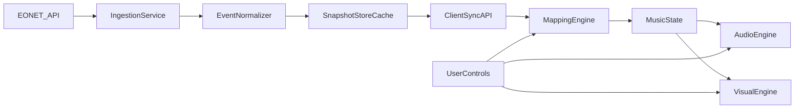

# Earth Sings - Design Document and Project Plan

## 1) Project Overview

Earth Sings is a generative audiovisual web application that transforms near-real-time natural event metadata from NASA EONET into evolving music and an interactive map. The system is inspired by TrainJazz's "real-world movement -> live musical structure" idea, but reinterprets it around planetary events (wildfires, storms, volcanoes, floods, etc.) instead of transit vehicles.

Primary goals:
- Make Earth system activity perceptible through sound, not just visuals.
- Preserve semantic meaning in mappings so listeners can interpret what they hear.
- Support iterative development from offline prototype to near-real-time experience.

Non-goals for early phases:
- Scientific forecasting or risk prediction.
- Full global event completeness across all sources on day one.
- Studio-grade mastering; musical clarity and meaning are prioritized first.

## 2) Core Concept

TrainJazz concept (reference pattern):
- Input is dense, continuously changing position/state data (trains).
- Music changes as entities move through a normalized spatial frame.
- Visual and audio layers are synchronized.

Earth Sings reinterpretation:
- Input is curated event metadata and geometries from EONET.
- Music reflects event category, recency, persistence, and geographic distribution.
- Instead of "vehicle motion across a route," the central metaphor is "Earth activity as an evolving ensemble."

Design principle:
- Every mapping should answer: "If this parameter changes, what meaningful sonic change should users perceive?"

## 3) Part 1 - Systems-Level Analysis of TrainJazz

## 3.1 Likely Core Components

- Data ingestion layer: poll/stream real-time transit feed snapshots.
- Data normalization layer: map route/position/status into stable musical coordinates.
- Mapping engine: convert entity features into note events, timing, dynamics, and timbre.
- Audio engine: schedule and synthesize voices (browser Web Audio stack).
- Visual engine: render moving entities and synchronized state on map/canvas.
- Session personalization: adjust mix weighting from user location and app settings.

## 3.2 Likely Data Flow (Input -> Sound)

1. Fetch latest transit state from upstream feed.
2. Parse and normalize train positions by route and relative progress.
3. Compute deltas since prior frame (new positions, active density, regional clusters).
4. Transform deltas into musical events (note on/off, phrase changes, rests, accents).
5. Schedule events on a musical clock with lookahead buffering.
6. Render map updates aligned to the same timeline as audio scheduling.
7. Apply user-centric mix weighting (nearby trains louder, distant trains softer).

## 3.3 Key Abstractions

- Entity -> voice: each train or train group maps to an instrument role.
- Position -> pitch domain: normalized route position selects pitch/register.
- Density -> texture: high activity increases sustain/polyphony; low activity increases space.
- Region -> pan/stereo field: geography contributes spatialization.
- Time window -> harmonic context: long, slow harmonic cycles avoid randomness.

## 3.4 Real-Time Constraints

- Timing precision: JavaScript UI timers are not enough; audio scheduling must use an audio clock + lookahead.
- Jitter and missing updates: network irregularity requires interpolation/smoothing/fallback behavior.
- Data spikes: rush-hour density can overload both audio and visuals; voice limiting is required.
- User gesture policies: browser audio requires explicit start interaction.
- Synchronization drift: map animation and audio transport can diverge without shared timing strategy.

## 4) Part 2 - Likely TrainJazz Tech Stack (with Tradeoffs)

## 4.1 Frontend Framework and Rendering

Default recommendation:
- React + TypeScript for UI/state + map library (Mapbox GL JS or Leaflet) for spatial view.

Alternatives:
- SvelteKit: lighter runtime, simpler reactivity; smaller ecosystem for larger team workflows.
- Vanilla TS + minimal libs: highest control and performance; slower iteration and less structure.

Tradeoff summary:
- React provides strongest ecosystem and maintainability for iterative product work.
- Svelte can reduce overhead but may increase hiring/onboarding constraints depending on team familiarity.

## 4.2 Audio Synthesis Layer

Default recommendation:
- Tone.js on top of Web Audio API for transport/scheduling/instruments/effects.

Alternatives:
- Raw Web Audio API: maximum control and minimal abstraction; higher implementation complexity.
- WebAssembly audio stack (custom DSP): best for advanced synthesis; overkill for early phases.

Tradeoff summary:
- Tone.js accelerates musical prototyping and robust timing with less boilerplate.
- Raw Web Audio becomes attractive only when Tone abstractions become limiting.

## 4.3 Backend and Data Access

Default recommendation:
- Lightweight backend-for-frontend (BFF) using Node.js (Fastify/Express) to cache upstream feeds and shape payloads.

Alternatives:
- Fully frontend-only direct API fetch: simplest deployment; rate-limit/CORS/consistency risks.
- Serverless edge functions: scalable and cost-efficient; higher complexity in observability and local testing.

Tradeoff summary:
- BFF gives resilience, caching, and schema stability while staying simple.

## 4.4 Data Ingestion Pattern

Default recommendation:
- Poll upstream API at controlled cadence; emit normalized snapshots to client.

Alternatives:
- WebSocket push from backend: lower client polling overhead; higher infra complexity.
- SSE stream: simpler than WebSocket for one-way updates; still adds streaming infrastructure.

Tradeoff summary:
- Polling is easier and sufficient for early near-real-time art experiences.
- Move to push only if cadence/scale demands it.

## 4.5 Hosting and Deployment

Default recommendation:
- Frontend on Vercel/Netlify, backend on Render/Fly.io (or Vercel functions for small BFF).

Alternatives:
- Single VPS deployment: full control; operational overhead.
- Cloud container platform (ECS/GKE): scalable; disproportionate complexity for early-stage scope.

Tradeoff summary:
- Managed platforms maximize iteration speed and reduce ops burden.

## 5) Part 3 - New Project Mapping Using NASA EONET

EONET provides curated near-real-time event metadata (categories, sources, geometry/time). Earth Sings should treat this as an "event ensemble score."

## 5.1 Mapping Model (What Maps to What)

- Event category -> instrument family/timbre
  - Wildfires: bright percussive textures or crackling high-mid voices.
  - Severe storms: low-frequency sustained layers and swells.
  - Volcanoes: distorted/drone-like tones with sparse accents.
  - Floods: fluid arpeggiated motifs with moderate sustain.
- Event recency (new vs ongoing) -> attack/brightness
  - Newly detected events sound more pronounced.
  - Aging events gradually soften or move to background layers.
- Event count by region -> rhythmic density
  - More simultaneous events in region increase local rhythmic activity.
- Geographic position -> spatial panning / map-linked sonic field
  - Longitude maps to stereo pan; latitude can influence register bands.
- Source confidence/curation characteristics -> modulation depth or effect intensity (optional, later phase).

## 5.2 How to Keep Output Meaningful (Not Random)

- Rule-based mappings with explicit rationale, not arbitrary note selection.
- Stable harmonic framework (mode/chord cycle) so category differences remain legible.
- Bounded parameter ranges to prevent noisy extremes.
- Temporal smoothing/hysteresis so brief API fluctuations do not create chaotic jumps.
- Distinct sonic identity per category, validated by listening tests.

## 5.3 Conceptual Difference from TrainJazz

- TrainJazz is primarily movement-on-routes sonification.
- Earth Sings is event-state-and-distribution sonification.
- Train systems are high-frequency positional updates; EONET is curated event metadata with varying update cadence.
- Earth Sings must emphasize semantic legibility over positional continuity.

## 6) Part 4 - System Architecture and Module Responsibilities

## 6.1 Layered Architecture

- External data layer: EONET API (v3 endpoints for events/categories/sources).
- Ingestion and normalization layer (backend): polling, validation, canonical event model, caching.
- Mapping and composition layer (frontend or shared): transforms canonical events into musical state.
- Audio rendering layer (frontend): scheduler, instrument graph, mixer, effects.
- Visual rendering layer (frontend): map markers, timeline, filters, synchronized highlights.
- Interaction layer: controls (region/category filters, tempo profile, focus mode).
- Observability layer: client metrics, backend logs, ingestion health.

## 6.2 Textual Data Flow Diagram

## 6.3 Key Modules and Responsibilities

- `IngestionService`
  - Fetches EONET on schedule, retries failures, records fetch health.
- `EventNormalizer`
  - Converts API payloads into canonical shape with stable IDs and derived fields.
- `SnapshotStore`
  - Maintains latest snapshots plus short history windows for deltas/trends.
- `MappingEngine`
  - Applies deterministic mapping rules from event features to musical parameters.
- `AudioEngine`
  - Owns transport clock, instrument routing, voice limits, and transitions.
- `VisualEngine`
  - Renders event markers and contextual layers synchronized to musical state.
- `InteractionController`
  - Applies user filters and focus decisions to both audio and visual outputs.

## 6.4 Technical Decisions and Rationale

- Canonical data model first:
  - Prevents API-shape coupling and makes testing easier.
- Deterministic mapping rules before ML/generative complexity:
  - Improves interpretability and user trust.
- Separate mapping from rendering:
  - Enables independent tuning of musical logic without destabilizing UI/audio internals.
- Snapshot + diff strategy:
  - Supports meaningful transitions instead of stateless re-rendering.

## 6.5 Risks and Unknowns

- Event cadence variability:
  - Some categories may update too sparsely for compelling continuous audio.
- Curation inconsistencies:
  - Event boundaries can vary by source/curator interpretation.
- Sonic fatigue:
  - Long sessions need macro-variation without losing mapping clarity.
- Browser performance:
  - Heavy map rendering and polyphonic audio can contend for resources.
- Product ambiguity:
  - Balance between artistic sonification and informational dashboard needs validation.

Mitigation strategy:
- Start with constrained category subset and strict voice budgets.
- Add user-selectable listening modes (ambient/informative/focused).
- Run periodic listening sessions with explicit interpretation tests.

## 7) Part 5 - Step-by-Step Iterative Build Plan

## Phase 0 - Simplest Prototype (No Real-Time Data)

What to build:
- Static JSON fixture representing 20-50 synthetic Earth events.
- Basic mapping engine that converts fixture into repeatable musical patterns.
- Minimal UI with play/stop and one filter (category).

What success looks like:
- App plays a stable 2-3 minute evolving loop where category differences are audibly distinct.
- Replaying same fixture yields same structure (deterministic baseline).

What to test:
- Mapping determinism across reloads.
- Audio start/stop behavior in browser gesture constraints.
- CPU load on target browser during 5-minute run.

What to decide before moving on:
- Final initial category set (for example: wildfire, storm, volcano, flood).
- Harmonic strategy (single mode vs slow rotating chord sets).

## Phase 1 - Basic Data Integration

What to build:
- Backend ingestion endpoint pulling EONET v3 events on interval.
- Canonical event normalization and cached snapshot endpoint.
- UI switch from fixture mode to live snapshot mode.

What success looks like:
- App consistently fetches and displays current event set.
- Data errors/failures degrade gracefully without crashing playback.

What to test:
- Ingestion retries and fallback snapshot behavior.
- Schema drift handling for optional/missing fields.
- End-to-end latency from fetch to UI update.

What to decide before moving on:
- Polling cadence and cache TTL targets.
- Whether to include all categories or curated subset in live mode.

## Phase 2 - First Meaningful Audio Output

What to build:
- Delta-aware mapping (new/continuing/ended events affect phrasing).
- Voice management (polyphony limits, priority rules, fade logic).
- Category-specific instrument palette version 1.

What success looks like:
- Listeners can reliably identify at least 3 categories by sound profile.
- Musical transitions remain smooth when event set changes.

What to test:
- Category recognition listening tests (small user group).
- Edge cases: sudden event spikes, sparse updates, empty dataset.
- Timing stability (no audible jitter/dropouts under normal load).

What to decide before moving on:
- Which mappings feel meaningful vs decorative.
- Default listening profile (ambient vs analytical emphasis).

## Phase 3 - Interactive UI

What to build:
- Interactive map with selectable regions and event detail panel.
- Controls: category toggles, intensity scaling, focus mode.
- Audio-visual sync indicators (highlighting events currently influencing sound).

What success looks like:
- Users can intentionally alter what they hear via map/filter controls.
- Visual state clearly explains current sonic texture.

What to test:
- UX clarity of controls and mapping explainability.
- Accessibility basics (keyboard access, contrast, motion settings where relevant).
- Sync behavior between selected events and audible changes.

What to decide before moving on:
- Interaction defaults (auto-play policy after gesture, default filters).
- Whether to prioritize educational framing or ambient art framing in UI copy.

## Phase 4 - Refinement

What to build:
- Presets/listening modes, improved mixing, adaptive dynamics.
- Performance optimizations and observability dashboard for ingestion/audio health.
- Session polish: onboarding tooltip, mapping legend, fallback messaging.

What success looks like:
- Stable 20+ minute sessions without notable degradation.
- New users understand the mapping model within first few minutes.
- System is deployment-ready with clear operational runbook.

What to test:
- Long-session memory/CPU behavior.
- Cross-browser playback reliability.
- Fault injection: API downtime, partial data, high-latency conditions.

What to decide before moving on:
- Launch scope (private alpha vs public release).
- Post-launch roadmap priorities (more categories, historical replay, shareable scenes).

## 8) Part 6 - Interactive Workflow Between You and Me

Working model for future implementation:

- We break work into small tasks with one explicit outcome each.
- I provide tradeoffs before coding whenever there are multiple valid approaches.
- You approve the next task before I implement it.
- I implement only one feature at a time, then stop for review.
- Each feature delivery includes:
  - What changed.
  - Why this approach was chosen.
  - How to test it locally.
  - What decision is needed next.

Suggested task granularity:
- 30-120 minute implementation units (single module, single behavior, or single UI control).
- No bundled multi-feature drops unless you request it.

Definition of done per task:
- Feature works for defined acceptance criteria.
- Basic error/edge handling in place.
- Notes captured for next tradeoff/decision point.

## 9) Recommended Immediate Next Step

Begin with Phase 0 by locking the initial mapping table (category -> instrument family, recency -> articulation, region -> pan/register) and validating it with a deterministic fixture-based audio prototype before integrating live EONET data.
